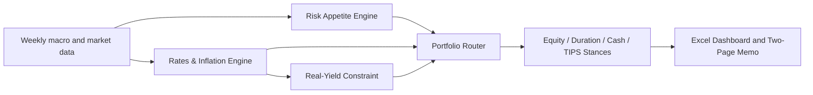

# Macro Regime-to-Portfolio Decision Framework

An automated macro research workflow that translates weekly risk appetite,
rates, inflation, and real-yield signals into transparent multi-asset
portfolio stances.

> Python calculates. Excel explains. Memo decides.


## Overview

This project is designed for macro and multi-asset research rather than
single-security selection. It focuses on how credit conditions, financial
conditions, volatility, labor-market stress, nominal yields, inflation
expectations, and real yields change the relative attractiveness of:

- Equities
- High-quality duration
- Cash
- TIPS and inflation hedges

The framework is not a trading signal, return forecast, or portfolio
optimizer. Its purpose is to create a repeatable and auditable decision
process that converts macro evidence into portfolio positioning language.

## Decision architecture



### Risk Appetite Engine

The Risk Appetite Engine combines four stress channels:

- High Yield Option-Adjusted Spread: credit stress
- National Financial Conditions Index: broad financial conditions
- VIX: high-volatility stress
- Initial Claims: labor-market stress

| Score | Classification |
|---:|---|
| 0 | Risk-On |
| 1-2 | Neutral |
| 3-4 | Risk-Off |

Credit stress is triggered by either an elevated spread level or four-week
widening. The other three channels use level-only rules.

### Rates & Inflation Engine

The rates and inflation backdrop is represented by a two-by-two regime map:

| Regime | Rate Pressure | Inflation Concern | Interpretation |
|---|---:|---:|---|
| Regime 1 | ON | ON | Rate and inflation pressure |
| Regime 2 | ON | OFF | Rate pressure only |
| Regime 3 | OFF | ON | Inflation concern only |
| Regime 4 | OFF | OFF | No major rate or inflation pressure |

The 10-year real yield is intentionally not a third regime axis. It acts as a
constraint that can cap aggressive equity or duration overweight positions.

### Portfolio Router

The Portfolio Router maps the Risk Appetite classification and Rates &
Inflation regime into deterministic stances configured in `config.yaml`.
Outputs include:

- Equity, duration, cash, and TIPS stances
- Illustrative stance bands
- Real-yield adjustments
- Portfolio notes
- Rule-derived next triggers

## Data inputs

The default configuration uses these FRED series:

| Series ID | Description | Role |
|---|---|---|
| `BAMLH0A0HYM2` | High Yield Option-Adjusted Spread | Credit stress |
| `NFCI` | Chicago Fed National Financial Conditions Index | Financial conditions |
| `VIXCLS` | CBOE Volatility Index | Volatility stress |
| `ICSA` | Initial Claims | Labor-market stress |
| `DGS10` | 10-Year Treasury Yield | Rate pressure |
| `T10YIE` | 10-Year Breakeven Inflation Rate | Inflation concern |
| `DFII10` | 10-Year Real Yield | Portfolio constraint |
| `DGS2` | 2-Year Treasury Yield | Curve context |

Observations are aligned to completed week-ending Fridays. Thresholds use
rolling 52-week 80th percentiles and four-week changes where specified.

## Outputs

Running the framework creates:

```text
outputs/
├─ Macro_Regime_Framework_Output.xlsx
├─ Macro_Regime_Framework_Memo.pdf
├─ weekly_memo.txt
└─ archive/YYYY-MM-DD/
```

The generated workbook contains:

- Dashboard
- Two memo presentation sheets
- Portfolio Router
- Risk Appetite detail
- Rates & Inflation detail
- Stress Event Audit
- Regime Co-occurrence matrix
- Data Quality checks

Complete generated workbooks are excluded from Git because their hidden data
sheets can contain full third-party histories. A sample PDF is available in
[`sample_output`](sample_output/).

## Historical diagnostics

Two diagnostics assess framework behavior:

1. **Stress Event Audit** checks whether selected historical stress episodes
   were recognized and records detection lag, peak risk score, and peak
   rates/inflation regime.
2. **Regime Co-occurrence** shows how often Risk Appetite classifications and
   Rates & Inflation regimes occurred together.

These are framework diagnostics, not portfolio-return backtests.


## Installation

### 1. Create and activate a virtual environment

```powershell
python -m venv .venv
.\.venv\Scripts\Activate.ps1
```

### 2. Install dependencies

```powershell
pip install -r requirements.txt
```

### 3. Set a FRED API key

```powershell
$env:FRED_API_KEY="YOUR_FRED_API_KEY"
```

### 4. Run the workflow

```powershell
python run_weekly.py
```

On Windows with Microsoft Excel installed, this creates Excel, text, and PDF
outputs. On other operating systems, or when PDF export is not required:

```bash
python run_weekly.py --skip-pdf
```

## Optional local history

The public configuration uses FRED-only data by default. An optional local
High Yield OAS history file can extend the diagnostic period. The local file
is not included in the repository; see [`data/local/README.md`](data/local/README.md).

## Tests

```bash
pip install -r requirements-dev.txt
pytest -q
python validate_release.py
```

The tests cover engine classification, the real-yield constraint,
data-quality validity, and the Excel template contract.

## Limitations

- The framework does not forecast returns.
- It is not a trading system or portfolio optimizer.
- Stance bands are illustrative rather than optimized target weights.
- Rolling percentile rules can lag abrupt turning points.
- Selected stress windows are diagnostic choices.
- PDF export requires Windows and a locally installed copy of Microsoft Excel.
- FRED and other data providers retain their respective data rights.

## Methodology

Detailed rules and design rationale are documented in
[`docs/methodology.md`](docs/methodology.md).

## Author

Junghyun (Leo) Im
