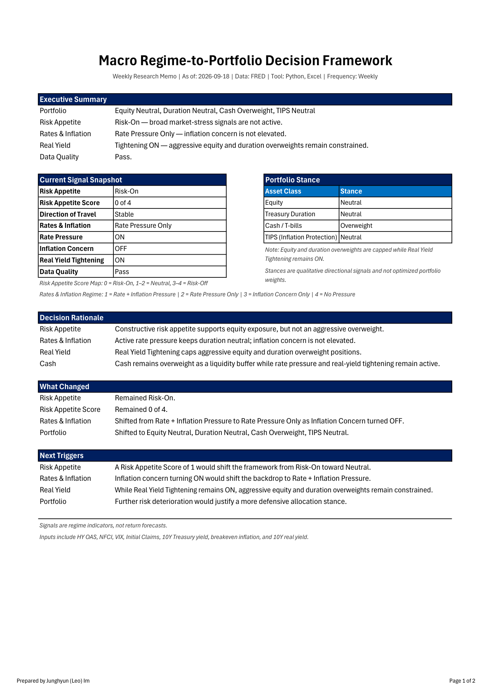
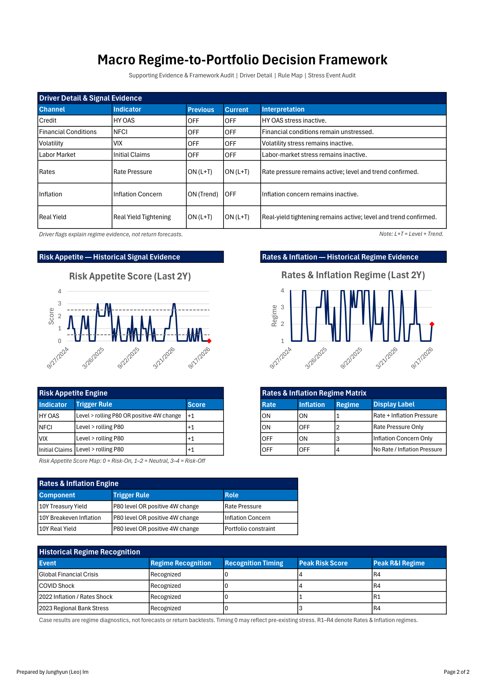

# Macro Regime-to-Portfolio Decision Framework

## 1. Project Overview

This project is a compact, rule-based macro research framework that translates market and macro conditions into asset-allocation and risk-positioning guidance.

The framework is designed around the principle:

> Python calculates. Excel explains. Memo decides.

The goal is not to build a trading system, optimize backtested returns, or select individual securities. Instead, the project creates a disciplined and repeatable decision framework for interpreting macro regimes and translating them into portfolio stance decisions across:

* Equities
* High-quality government duration
* Cash
* TIPS and inflation hedges

The duration allocation primarily represents U.S. Treasury exposure rather than corporate credit, which combines interest-rate risk with credit-spread risk.

This project reflects a macro and multi-asset research process focused on risk appetite, rates, inflation, real yields, and their implications for portfolio positioning.

---

## 2. Framework Structure

The framework is organized into three linked research components:

1. Risk Appetite Engine
2. Rates & Inflation Engine
3. Portfolio Router

Together, these components translate macro and market conditions into a structured multi-asset stance.

---

### Risk Appetite Engine

The Risk Appetite Engine evaluates whether the broad market environment supports or penalizes risk-taking.

It uses four stress channels:

* High Yield Option-Adjusted Spread
* Chicago Fed National Financial Conditions Index
* CBOE Volatility Index
* Initial Claims

The engine classifies the market environment as:

* Risk-On
* Neutral
* Risk-Off

The Risk Appetite Score is based on transparent stress flags across credit, financial conditions, volatility, and labor-market conditions.

The engine also produces:

* Signal reason codes
* Data-validity checks
* Direction of travel
* Rule-derived next triggers

Credit stress is activated by either an elevated High Yield spread level or four-week spread widening. The other three channels use level-based rules.

---

### Rates & Inflation Engine

The Rates & Inflation Engine evaluates the nominal-rate and inflation backdrop using:

* 10-Year Treasury Yield
* 10-Year Breakeven Inflation Rate
* 10-Year Real Yield

The core Rates & Inflation classification is a two-by-two regime structure:

| Regime   | Rate Pressure | Inflation Concern | Interpretation                      |
| -------- | ------------: | ----------------: | ----------------------------------- |
| Regime 1 |            ON |                ON | Rate and inflation pressure         |
| Regime 2 |            ON |               OFF | Rate pressure only                  |
| Regime 3 |           OFF |                ON | Inflation concern only              |
| Regime 4 |           OFF |               OFF | No major rate or inflation pressure |

The 10-Year Real Yield is not treated as a third regime axis. Instead, Real Yield Tightening acts as a portfolio constraint because rising real yields can limit aggressive equity or duration overweight positions.

The 2-Year Treasury Yield is retained for yield-curve context only. It does not currently determine regime classification or portfolio stances.

---

### Portfolio Router

The Portfolio Router combines the Risk Appetite classification and the Rates & Inflation regime to generate multi-asset stance guidance.

Outputs include:

* Equity stance
* Duration stance
* Cash stance
* TIPS stance
* Illustrative stance bands
* Real Yield Tightening adjustments
* Portfolio interpretation notes
* Rule-derived next triggers

If Real Yield Tightening is ON, aggressive Equity Overweight or Duration Overweight positions may be capped at Neutral.

The Portfolio Router is not an optimizer. It is a transparent, rule-based mapping from macro regime combinations to portfolio stance bands.

---

## 3. Data Sources

The framework uses data accessed through the FRED API.

Core decision series include:

| Internal Name | FRED Series    | Description                                     | Framework Role       |
| ------------- | -------------- | ----------------------------------------------- | -------------------- |
| `hy_oas`      | `BAMLH0A0HYM2` | High Yield Option-Adjusted Spread               | Credit stress        |
| `nfci`        | `NFCI`         | Chicago Fed National Financial Conditions Index | Financial conditions |
| `vix`         | `VIXCLS`       | CBOE Volatility Index                           | Volatility stress    |
| `claims`      | `ICSA`         | Initial Claims                                  | Labor-market stress  |
| `dgs10`       | `DGS10`        | 10-Year Treasury Yield                          | Rate pressure        |
| `t10yie`      | `T10YIE`       | 10-Year Breakeven Inflation Rate                | Inflation concern    |
| `dfii10`      | `DFII10`       | 10-Year Real Yield                              | Portfolio constraint |

Context series:

| Internal Name | FRED Series | Description           | Framework Role           |
| ------------- | ----------- | --------------------- | ------------------------ |
| `dgs2`        | `DGS2`      | 2-Year Treasury Yield | Yield-curve context only |

The 2-Year Treasury Yield is retained for contextual analysis and does not currently affect the regime or portfolio decision rules.

---

## 4. Key Design Principles

### Small but defensible

The framework intentionally avoids unnecessary complexity.

It does not rely on:

* Optimized indicator weights
* Machine-learning models
* Black-box forecasts
* Portfolio-return optimization
* Single-security selection

The objective is to build a transparent research process that can be explained, audited, challenged, and improved over time.

---

### Rule-based and auditable

Signals are generated from explicit rules, including:

* Rolling 52-week 80th-percentile thresholds
* Four-week changes where specified
* Level and momentum reason codes
* Explicit regime classification
* Data-validity checks
* Data-quality confidence

This makes the framework easier to interpret and audit in an investment-research setting.

---

### Completed Friday as-of convention

Weekly observations are aligned to week-ending Friday.

The framework uses the latest completed Friday as the official as-of date. This prevents incomplete current-week observations from being treated as finalized weekly data.

---

### Insufficient Data protection

Missing historical information is not classified as Risk-On.

When required inputs are unavailable, the relevant output is marked as:

* Insufficient Data
* INVALID

This prevents misleading historical classifications and avoids producing false confidence when the underlying data is incomplete.

---

## 5. Data Quality and Confidence

Data Quality checks assess whether the weekly output is operationally reliable.

Pre-export checks include:

* Missing latest values
* Series freshness
* Rolling-window sufficiency
* As-of-date alignment
* Portfolio Router output availability
* Latest signal validity

Post-export checks include:

* Excel output created successfully
* Weekly memo created successfully
* PDF output created successfully when applicable

Confidence levels:

| Confidence | Meaning                                                 |
| ---------- | ------------------------------------------------------- |
| High       | Data are complete and all major checks pass             |
| Medium     | A minor warning exists, but no major failure is present |
| Low        | A serious data or output issue exists                   |

Confidence measures output reliability, not investment conviction.

---

## 6. Outputs

Running the framework creates:

```text
outputs/
  Macro_Regime_Framework_Output.xlsx
  Macro_Regime_Framework_Memo.pdf
  weekly_memo.txt
  archive/YYYY-MM-DD/
```

The production workbook contains:

* Dashboard
* Two memo presentation sheets
* Portfolio Router detail
* Risk Appetite detail
* Rates & Inflation detail
* Stress Event Audit
* Regime Co-occurrence
* Data Quality
* Supporting calculation and source-data sheets

The PDF provides a concise two-page macro-to-portfolio memo designed for rapid review.

The text memo provides a lightweight summary of:

* Current regime
* Direction of travel
* Portfolio stance
* What changed
* Next triggers
* Key risks

---

### Public sample outputs

The repository includes public sample artifacts:

* [Download the public sample workbook](sample_output/Macro_Regime_Framework_Output_Sample.xlsx)
* [Open the sample PDF memo](sample_output/Macro_Regime_Framework_Memo_Sample.pdf)
* [Open the sample text memo](sample_output/weekly_memo_sample.txt)

The public sample workbook is generated from the production output and retains the presentation and diagnostic sheets needed to review the framework.

Full production workbooks and complete underlying raw-data histories are excluded from the repository.

---

### Memo Preview

#### Page 1



#### Page 2



[Open the full PDF memo](./sample_output/Macro_Regime_Framework_Memo_Sample.pdf)

---
## 7. Historical Diagnostics

Two diagnostics assess framework behavior.

### Stress Event Audit

The Stress Event Audit evaluates whether selected historical stress episodes were recognized by the framework.

It records:

* Whether the event was detected
* Detection lag
* Peak Risk Appetite Score
* Peak Rates & Inflation regime
* Relevant signal behavior

### Regime Co-occurrence

The Regime Co-occurrence matrix shows how frequently Risk Appetite classifications and Rates & Inflation regimes occurred together.

This provides a structural view of how the two engines interact across the historical sample.

These diagnostics evaluate framework behavior. They are not portfolio-return backtests.

The complete diagnostic tables can be reviewed in the public sample workbook:

[Download the public sample workbook](sample_output/Macro_Regime_Framework_Output_Sample.xlsx)

---

## 8. Installation

### 1. Create and activate a virtual environment

```powershell
python -m venv .venv
.\.venv\Scripts\Activate.ps1
```

### 2. Install dependencies

```powershell
python -m pip install -r requirements.txt
```

### 3. Set a FRED API key

```powershell
$env:FRED_API_KEY="YOUR_FRED_API_KEY"
```

### 4. Run the weekly workflow

```powershell
python run_weekly.py
```

On Windows with Microsoft Excel installed, the workflow creates Excel, text, and PDF outputs.

When PDF export is not required:

```powershell
python run_weekly.py --skip-pdf
```

---

## 9. Tests and Release Validation

Install development dependencies:

```powershell
python -m pip install -r requirements-dev.txt
```

Run the test suite:

```powershell
python -m pytest -q
```

Validate the public release structure:

```powershell
python validate_release.py
```

The test suite covers:

* Risk Appetite classification
* Rates & Inflation classification
* Real Yield portfolio constraints
* Data-quality validity
* Excel-template contracts
* Public-release file structure

GitHub Actions automatically runs the tests and release validation after repository updates.

---

## 10. Limitations

* The framework does not forecast asset returns.
* It is not a trading system or portfolio optimizer.
* Stance bands are illustrative rather than optimized target weights.
* Rolling percentile rules may react with a lag around abrupt turning points.
* Selected historical stress events are diagnostic choices rather than an exhaustive event set.
* High-quality government duration is represented primarily through Treasury exposure.
* The 2-Year Treasury Yield is contextual and does not currently affect portfolio decisions.
* PDF export requires Windows and a locally installed copy of Microsoft Excel.
* FRED and other data providers retain their respective data rights.

---

## 11. Methodology

Detailed rules, design rationale, and implementation choices are documented in:

[Read the methodology](docs/methodology.md)

---

## 12. Author

Junghyun (Leo) Im

